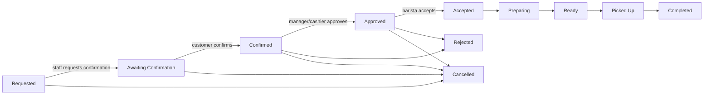

# Order state machine

The backend is authoritative. Customer confirmation and cancellation require ownership of the order. Late cancellation requires a reason and manager-level authority. Payment state is independent from order state. Legacy values are normalized only when reading; new writes use canonical labels.
